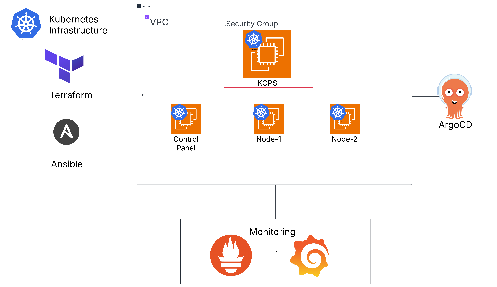
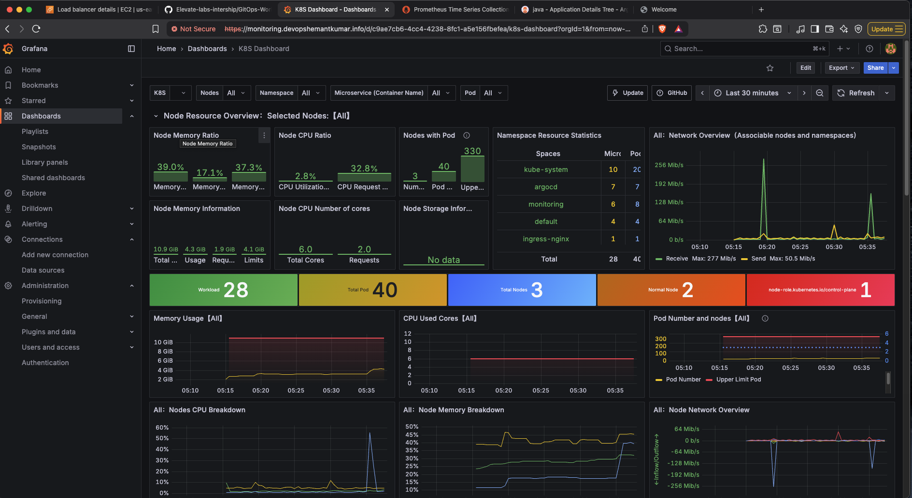
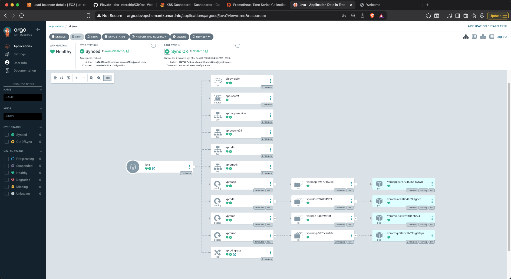
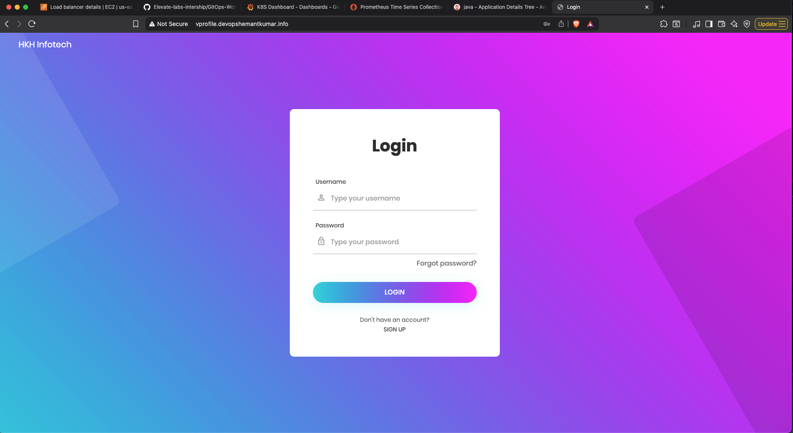
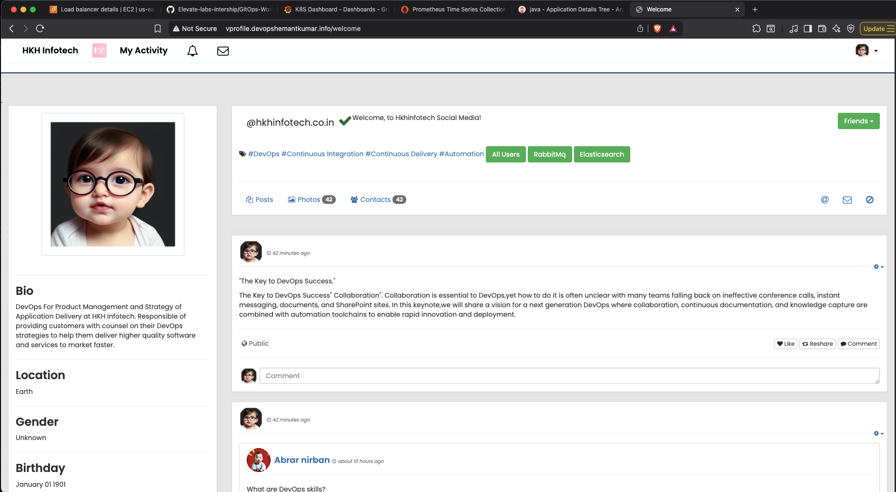

# GitOps Workflow using ArgoCD on Kubernetes

A complete DevOps project demonstrating Infrastructure as Code (IaC), Configuration Management, and GitOps practices using Terraform, Ansible, Kubernetes (kops), and ArgoCD.

## 🏗️ Architecture Overview

```
┌─────────────────┐    ┌─────────────────┐    ┌─────────────────┐
│   Terraform     │───▶│     Ansible     │───▶│   Kubernetes    │
│ (Infrastructure)│    │ (Configuration) │    │    (kops)       │
└─────────────────┘    └─────────────────┘    └─────────────────┘
                                                       │
                                              ┌─────────────────┐
                                              │     ArgoCD      │
                                              │   (GitOps)      │
                                              └─────────────────┘
```

## 📋 Prerequisites

- AWS Account with appropriate permissions
- Domain name (for DNS configuration)
- Local machine with:
  - Terraform installed
  - Git installed
  - SSH key pair

## 🚀 Step-by-Step Implementation

### Step 1: Infrastructure Provisioning with Terraform

#### 1.1 Navigate to Terraform Directory
```bash
cd terraform/
```

#### 1.2 Configure AWS Credentials
Create `credentials` file:
```ini
[default]
aws_access_key_id = YOUR_ACCESS_KEY
aws_secret_access_key = YOUR_SECRET_KEY
region = us-east-1
```

#### 1.3 Initialize and Apply Terraform
```bash
# Initialize Terraform
terraform init

# Plan the infrastructure
terraform plan

# Apply the infrastructure
terraform apply
```

**What this creates:**
- EC2 instance for kops management
- Security groups
- Key pairs
- S3 bucket for kops state
- Route53 hosted zone

### Step 2: Server Configuration with Ansible

#### 2.1 Navigate to Ansible Directory
```bash
cd ../ansible/
```

#### 2.2 Update Inventory
Update `inventory.yaml` with the EC2 instance IP from Terraform output:
```yaml
all:
  hosts:
    kops:
      ansible_host: YOUR_EC2_IP
  vars:
    ansible_user: ubuntu
    ansible_ssh_private_key_file: StackOps-1.pem
```

#### 2.3 Server Configuration (Automated)
**Note:** Server configuration is automatically handled by Terraform's `web.sh` script during provisioning.

**What gets installed automatically:**
- Ansible
- kops (Kubernetes Operations)
- kubectl
- AWS CLI
- Required dependencies

*Optional: Run `ansible-playbook server-config.yaml` if manual configuration is needed.*

### Step 3: AWS Credentials Setup (Automated)
**Note:** AWS credentials are automatically configured during Terraform provisioning via the `web.sh` script.

*Optional: Run `ansible-playbook kops/setup-credentials.yaml` if credentials need to be reconfigured.*

### Step 4: Kubernetes Cluster Setup with kops

#### 4.1 Create and Deploy Kubernetes Cluster
```bash
# Create cluster configuration and deploy
ansible-playbook kops/kops.yaml
```

**What this creates:**
- Kubernetes control plane
- Worker nodes
- Networking (Cilium CNI)
- AWS Load Balancers
- DNS records in Route53

### Step 5: Cluster Validation

```bash
# Validate the cluster is healthy
ansible-playbook kops/validation.yaml
```

**Expected Output:**
- All nodes in Ready state
- All system pods running
- Cluster validation successful

### Step 6: Ingress Controller Setup

#### 6.1 Install Nginx Ingress Controller
```bash
# Install ingress controller
ansible-playbook kops/ingress.yaml
```

**Note:** If you encounter LoadBalancer restrictions (common with new AWS accounts):
```bash
# Use NodePort instead of LoadBalancer
kubectl patch svc ingress-nginx-controller -n ingress-nginx -p '{"spec":{"type":"NodePort"}}'
```

### Step 7: Monitoring Stack Deployment

#### 7.1 Deploy Prometheus and Grafana
```bash
# Install monitoring stack
ansible-playbook monitoring/prometeus.yaml
```

**What this deploys:**
- Prometheus (metrics collection)
- Grafana (visualization)
- AlertManager (alerting)
- Node Exporter (node metrics)
- kube-state-metrics (Kubernetes metrics)

#### 7.2 Setup Monitoring Ingress
```bash
# Create ingress for monitoring services
ansible-playbook monitoring/monitoring-ingress.yaml
```

**Access URLs:**
- Grafana: `https://monitoring.devopshemantkumar.info`
- Prometheus: `https://prometheus.devopshemantkumar.info`

**Grafana Credentials:**
- Username: `admin`
- Password: `prom-operator`

### Step 8: ArgoCD Installation and Configuration

#### 8.1 Install ArgoCD
```bash
# Install ArgoCD
ansible-playbook argocd/argocd.yaml
```

#### 8.2 Configure ArgoCD for Ingress
```bash
# Patch ArgoCD for insecure mode (required for ingress)
ansible-playbook argocd/argocd-patch.yaml
```

#### 8.3 Get ArgoCD Admin Password
```bash
# Retrieve ArgoCD admin password
ansible-playbook argocd/get-argocd-password.yaml
```

**Access URL:**
- ArgoCD: `https://argo.devopshemantkumar.info`

**ArgoCD Credentials:**
- Username: `admin`
- Password: (retrieved from the password playbook)

## 🔧 Troubleshooting

### Common Issues and Solutions

#### 1. DNS Propagation Delay
**Problem:** `api.kubevpro.devopshemantkumar.info` not resolving
**Solution:** Add hosts entry temporarily:
```bash
ssh -i StackOps-1.pem ubuntu@YOUR_EC2_IP "echo 'MASTER_IP api.kubevpro.devopshemantkumar.info' | sudo tee -a /etc/hosts"
```

#### 2. LoadBalancer Creation Failed
**Problem:** AWS account doesn't support LoadBalancer creation
**Solution:** Use NodePort instead:
```bash
kubectl patch svc ingress-nginx-controller -n ingress-nginx -p '{"spec":{"type":"NodePort"}}'
```

#### 3. Cluster Validation Fails
**Problem:** Nodes not joining cluster
**Solution:** Wait 10-15 minutes for cluster bootstrap, then retry validation

#### 4. Ingress Server-Snippet Error
**Problem:** `server-snippet annotation cannot be used`
**Solution:** Remove server-snippet annotations from ingress templates

## 📁 Project Structure

```
GitOps-Workflow-using-ArgoCD-on-Kubernetes/
├── terraform/                 # Infrastructure as Code
│   ├── provider.tf           # AWS provider configuration
│   ├── vpc.tf               # VPC and networking
│   ├── instance.tf          # EC2 instance configuration
│   ├── SecGrp.tf            # Security groups
│   ├── Keypair.tf           # SSH key pair
│   ├── backend.tf           # Terraform backend
│   ├── variables.tf         # Variable definitions
│   ├── output.tf            # Output values
│   ├── web.sh              # Server initialization script
│   └── credentials         # AWS credentials
├── ansible/                 # Configuration Management
│   ├── inventory.yaml       # Ansible inventory
│   ├── StackOps-1.pem      # SSH private key
│   ├── cleanup.yaml        # Cleanup playbook
│   ├── kops/               # Kubernetes cluster management
│   │   ├── kops.yaml       # Cluster setup and deployment
│   │   ├── validation.yaml # Cluster validation
│   │   ├── ingress.yaml    # Ingress controller
│   │   └── check-ingress.yaml # Ingress status check
│   ├── monitoring/         # Monitoring stack
│   │   ├── prometeus.yaml  # Prometheus and Grafana
│   │   └── monitoring-ingress.yaml # Monitoring ingress
│   ├── argocd/            # GitOps deployment
│   │   ├── argocd.yaml    # ArgoCD installation
│   │   ├── argocd-patch.yaml # ArgoCD configuration
│   │   └── get-argocd-password.yaml # Password retrieval
│   └── templates/         # Kubernetes manifests
│       ├── argoingress.yaml
│       ├── grafanaingress.yaml
│       └── prometheusingress.yaml
├── k8s/                    # Application manifests
│   ├── appdeploy.yaml     # Application deployment
│   ├── appservice.yaml    # Application service
│   ├── appingress.yaml    # Application ingress
│   ├── dbdeploy.yaml      # Database deployment
│   ├── dbservice.yaml     # Database service
│   ├── dbpvc.yaml         # Database persistent volume
│   ├── mcdep.yaml         # Memcached deployment
│   ├── mcservice.yaml     # Memcached service
│   ├── rmqdeploy.yaml     # RabbitMQ deployment
│   ├── rmqservice.yaml    # RabbitMQ service
│   └── secert.yaml        # Secrets
├── images/                # Project screenshots
│   ├── architecture.png
│   ├── grafana-dashboard.png
│   ├── prometheus.png
│   ├── argocd.png
│   ├── application-homepage.png
│   └── application-dashboard.png
└── README.md              # This file
```

## 🎯 Learning Outcomes

This project demonstrates:

1. **Infrastructure as Code (IaC)** - Terraform for reproducible infrastructure
2. **Configuration Management** - Ansible for automated server setup
3. **Container Orchestration** - Kubernetes with kops for production-grade clusters
4. **GitOps Practices** - ArgoCD for declarative application deployment
5. **Monitoring & Observability** - Prometheus and Grafana stack
6. **DevOps Best Practices** - Automation, version control, and declarative configurations

## 📸 Project Screenshots

### Architecture Diagram

*Complete GitOps workflow architecture showing the integration between Terraform, Ansible, Kubernetes, and ArgoCD*

### Grafana Dashboard

*Grafana monitoring dashboard showing Kubernetes cluster metrics and performance indicators*

### Prometheus Metrics

*Prometheus metrics collection interface displaying cluster and application metrics*

### ArgoCD Application Dashboard

*ArgoCD GitOps dashboard showing application deployment status and synchronization*

### Application Home Page

*Deployed application home page accessible through the ingress controller*

### Application Dashboard

*Deployed application dashboard accessible through the ingress controller*

## 🔗 Access Points

After successful deployment:

| Service | URL | Credentials |
|---------|-----|-------------|
| ArgoCD | `https://argo.devopshemantkumar.info` | admin / (from password playbook) |
| Grafana | `https://monitoring.devopshemantkumar.info` | admin / prom-operator |
| Prometheus | `https://prometheus.devopshemantkumar.info` | No auth required |

## 🧹 Cleanup

To destroy all resources:

```bash
# Destroy Kubernetes cluster
kops delete cluster --name=kubevpro.devopshemantkumar.info --state=s3://kopsstate1234567890 --yes

# Destroy Terraform infrastructure
cd terraform/
terraform destroy
```

## 📚 Additional Resources

- [Terraform Documentation](https://www.terraform.io/docs)
- [Ansible Documentation](https://docs.ansible.com/)
- [kops Documentation](https://kops.sigs.k8s.io/)
- [ArgoCD Documentation](https://argo-cd.readthedocs.io/)
- [Prometheus Documentation](https://prometheus.io/docs/)

---

**Note:** This project is designed for learning purposes. For production use, consider additional security measures, backup strategies, and monitoring configurations.